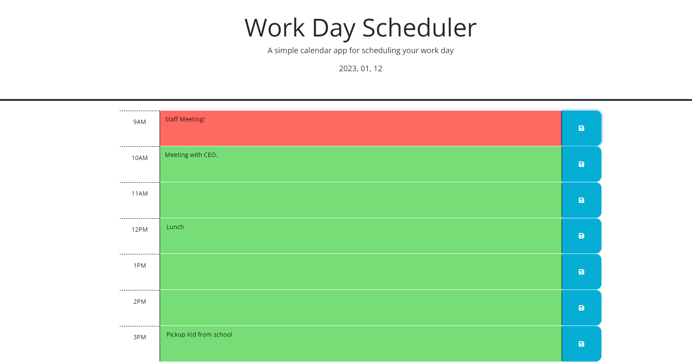

# Work Day Calender

## Descrpition

  -This is a light-weight web application that should be able to run on most any computer connected to the internet.
  -This simple web app features dynamicly updated javascript, html, and css powered by javascript
  -This web app features a javascript library, moment.js, that automaticaly get times, dates, time zones, and much more for me.
  -This web app features local storage to save your custom events to your browser so you can close the tab and have the same information later.

## Tech Stack

  ```md
  HTML, CSS, Javascript
  Bootstrap
  Jquery
  Moment.js
  Local storage
  ```

## User Story

  ```md
    As a student I want to create a web appplication 
    That can show my working times of the day
    That can track things I want to get done during the day
    That can display the current date
    that can store my costom events in local storage
    that is easily readable to me and others
  ```

## Preview

The following image displays the functionality of the application:



## Usage

  This project has no liscense, and is free to use in anyway anyone sees fit at any time.

  *This website is hosted live: [HERE](https://whotf1.github.io/workDayCalenderWebApp/)

  *you can also check out the source code and the repository here: [HERE](https://github.com/whotf1/workDayCalenderWebApp)

  *please feel free to fork, clone, or copy the repository, if you have inquiries about inproving this application please feel free to message me on github
